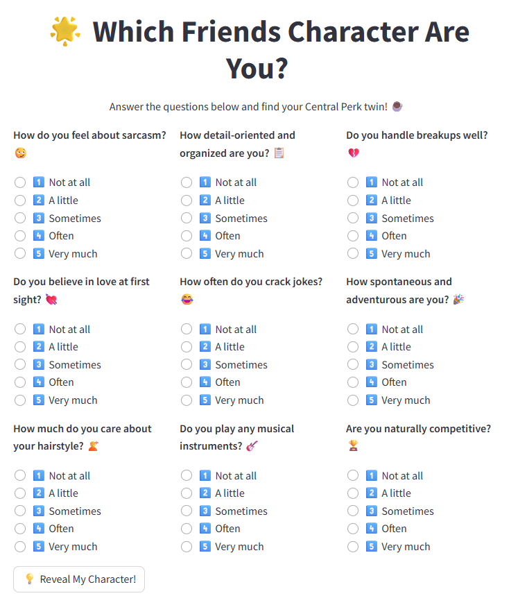
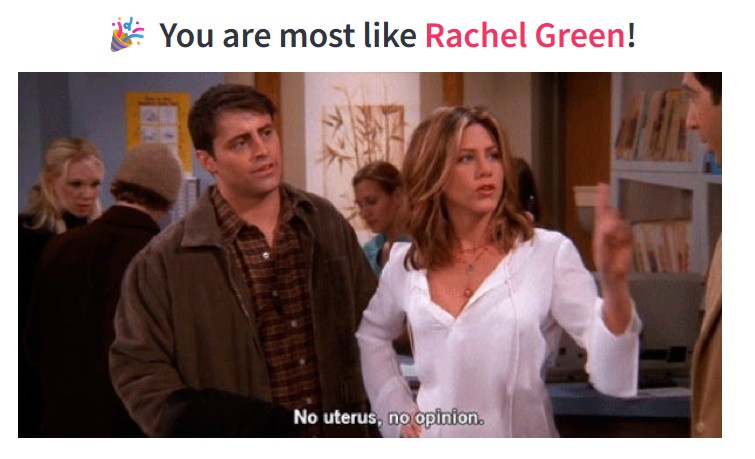

# 🎬 Friends Character Personality Quiz (Streamlit App)

Ever wondered which *Friends* character you're most like? Take this fun, interactive personality quiz built with **Streamlit** and discover your Central Perk twin!

## ✨ Features

- 🧠 9 quirky personality-based questions
- 🎭 Dynamic scoring system
- 📸 Displays character image & iconic quote on result
- 💻 Streamlit-powered and easy to run

## 📦 Tech Stack

- Python 🐍
- [Streamlit](https://streamlit.io/)
- NumPy

## 📸 Preview





## 🧪 Questions Sample

- *How organized are you?* 📋  
- *Do you handle breakups well?* 💔  
- *How often do you crack jokes?* 😂  

## 🧮 Character Logic

The quiz assigns scores (1–5) for each question. Based on your total score, you're matched with one of the 6 iconic characters:

| Score Range | Character         | Quote                                 |
|-------------|-------------------|----------------------------------------|
| 0–10        | Ross Geller       | "We were on a break!"                 |
| 11–15       | Rachel Green      | "No uterus, no opinion."             |
| 16–18       | Monica Geller     | "Welcome to the real world! It sucks."|
| 19–21       | Chandler Bing     | "Could I *be* wearing any more clothes?" |
| 22–23       | Phoebe Buffay     | "Smelly Cat, Smelly Cat..."          |
| 24+         | Joey Tribbiani    | "How you doin’?"                      |

## 🚀 Run Locally

1. Clone the repository  
   ```bash
   git clone https://github.com/AnnaFeleki/friends-quiz.git
   cd friends-quiz
